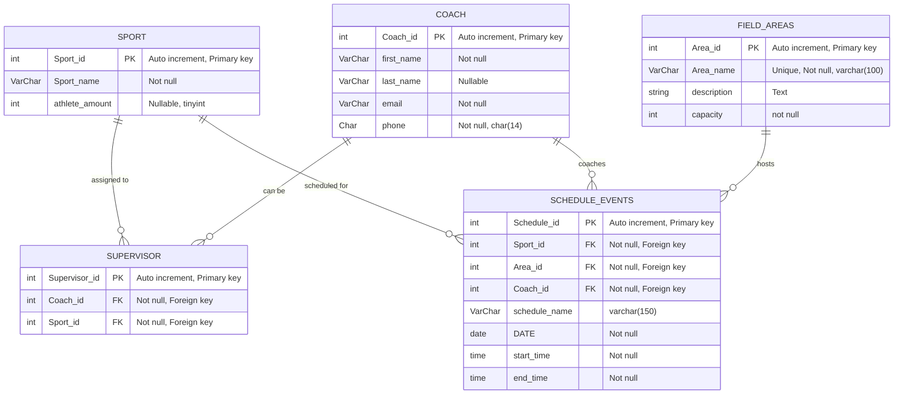
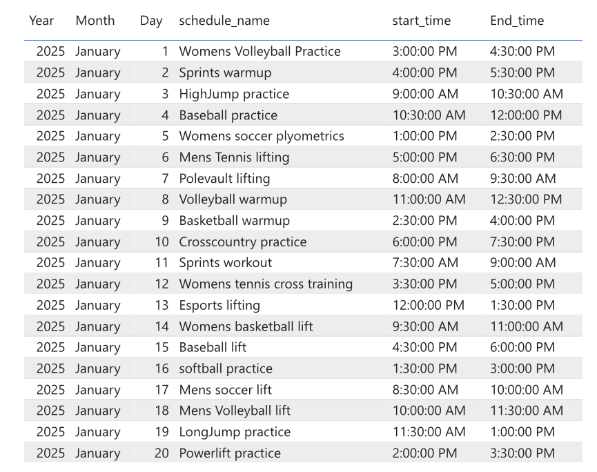
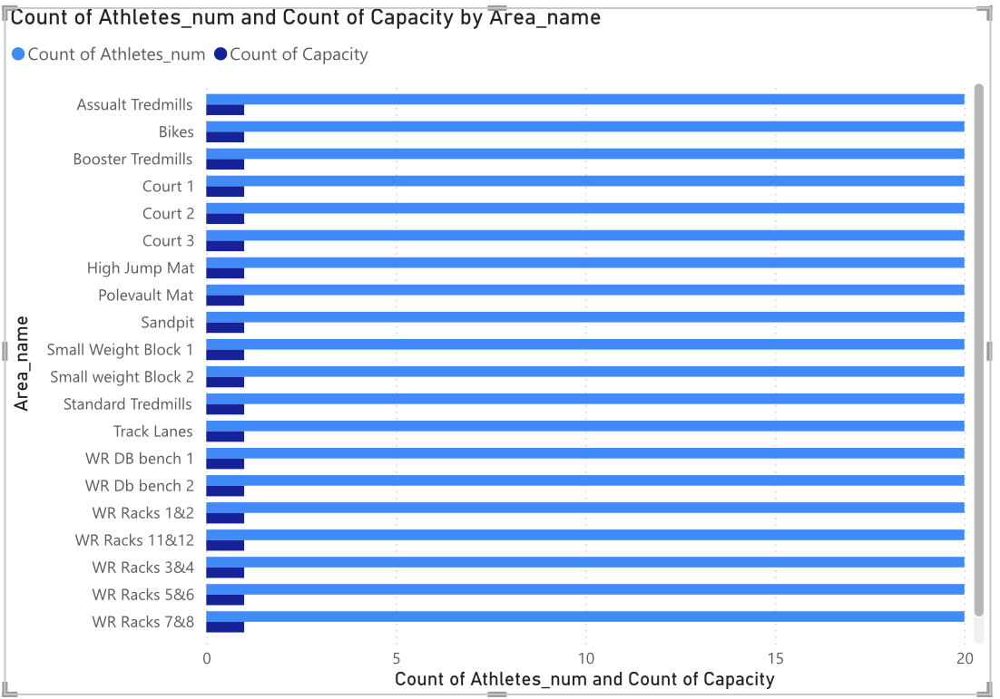

# **Fieldhouse Schedule Database Management Systems Final Project**
## Database Management Systems Final Project
## November 29th 2025

---
## Business/Organization Issue

Huntington University's plex fieldhouse is without a set schedule allowing multiple sports to practice at the same/similar timeframe. Students constantly walk to the plex only to see most of the equipment being inuse. Huntington is now in the process of building a plex fieldhouse schedule that allows students to view which area of the fieldhouse is being used and when based on the large sports teams that take up a majority of the area. 

This schedule is public so no student will be permitted to register an account to view the schedule, however coaches of athletics teams will be stored within the database. Coaches have the permission to schedule teams that they coach, so a coach can coach many teams, but only one can supervise over the specific scheduled event. Huntington University athletics will use this database to unsure non-student athletes have a schedule for when the sports team are occupying fieldhouse areas, as well as show over occupied areas to coaches booking and discuss future renovations based on over occupied areas.

## Usage from User's Perspective 

From a user’s perspective, this database has multiple uses. The first being acting as a booking center for coaches, when they want to book an area of the field house for their practices. When I had this design in mind, I knew that for the most part different sports at HU have practices at times that are consistent every week. So coaches who are registered with their coach_id would be able to schedule their team to practice in a certain area of the field house at a certain time.  

The second use of this database would be for everyone else, which is simply viewing the schedules already booked. This will allow not only athletes to know the times of their practices without their coaches telling them, but for non-athletes to know when’s the best time to go workout themselves without feeling overwhelmed with 2 or 3 different teams in that area. For any user that is not registered because they are not a coach, the public view of the schedule would be their use of this database.  

---
## ER Diagram



For my overall database I wanted to focus on the the biggest problem which was that there wasn't an actually schedule, but from the start I ran into the issue of who should be able to schedule. I didn't want anyone to be able to schedule because then you'd have lots of different areas booked with 1-3 people and then a team would just booked the same area and you'd get the same result, students getting overcrowded. Also if atheletic teams are needing that spot to practice for the sport they have to perform they wouldn't have a lot of options if everyone could schedule. To solve this problem I decided that only coaches would be able to book the fieldhose in this database and students could publicly view the schedule so that they can find times that work for them. This took away the trouble of registering students into this database, and solved the problem while still securing the schedule. 

When making the ER diagram at first I ran into the problem that a coach could schedule many sports and a sport could have many coaches. To fix this problem I made the supervisor table which allowed one coach to supervisor over the scheduled event fixing the many to many relationship and the issues of assistant coaches, or trainers maybe being registered into the database.

Overall the database focuses on the scheduling of HU's athletics in the fieldhouse. This made the most since to me since larger sports teams are the ones taking a majority of the area in the fieldhouse, and also need priority as a group since they will most likely be training to compete in athletic events.
 


## Created tables and insert statements

***Coach Table:***

The purpose of this table is to register coaches in the database so that they can schedule their teams within the fieldhouse. It also includes their contact information for any further questions or scheduling changes.

***Sport Table:***

The purpose of this table is to register the different sports teams HU has into the database so users looking at the schedule know which team is occupying a that specific place in the fieldhouse.

***Supervisor Table:***

The purpose of this table is to help with the many to many relationship between coach and sports. This table registers coaches as supervisor over the sport.

***FieldAreas Table:***

The purpose of this table is to highlight specific areas within the fieldhouse that can be booked. It also gives users the capacity and and description of that area.

***ScheduleEvents Table:***

The purpose of this table is to set up the schedule of the entire fieldhouse for the specific day, and timeframe. This table also gives and event name so users know what is going on.


```sql

CREATE TABLE Coach (
	Coach_id INT auto_increment NOT NULL primary key,
	first_name varchar (25) NOT NULL,
	last_name varchar (25) NULL,
	email varchar (50) not null,
	phone char (14) not null
) Engine=InnoDB;

CREATE TABLE Sport (
	Sport_id INT AUTO_INCREMENT NOT NULL PRIMARY KEY,
	Sport_name VARCHAR(40) NOT NULL,
	athlete_amount tinyint NULL
) ENGINE=innoDB;

CREATE TABLE Supervisor (
    supervisor_id INT AUTO_INCREMENT PRIMARY KEY,
    coach_id INT NOT NULL,
    sport_id INT NOT NULL
    ) ENGINE=innoDB;

CREATE TABLE FieldAreas (
    area_id INT AUTO_INCREMENT PRIMARY KEY,
    area_name VARCHAR(100) NOT NULL UNIQUE,
    description TEXT,
    capacity tinyint NOT NULL
    ) ENGINE=innoDB;

CREATE TABLE ScheduleEvents (
    schedule_id INT AUTO_INCREMENT PRIMARY KEY,
    sport_id INT NOT NULL,
    area_id INT NOT NULL,
    coach_id INT NOT NULL,
    schedule_name VARCHAR(150),
    DATE DATE NOT NULL,
    start_time TIME NOT NULL,
    end_time TIME NOT NULL
    ) ENGINE=innoDB;

```` 

## Insert statements
```sql
INSERT INTO Coach(coach_id, first_name, last_name, email, phone) VALUES
(100, 'Mary', 'Lane', 'LaneM@huntington.edu', '(260)-111-1111'),
(101, 'Bobby', 'Cloud', 'CloudB@huntington.edu', '(260)-222-2222'),
(102, 'Sarah', 'Williams', 'WilliamsS@huntington.edu', '(260)-333-3333'),
(103, 'Jayda', 'Carpenter', 'CarpenterJ@huntington.edu', '(260)-444-4444'),
(104, 'Coby', 'Baily', 'BailyC@huntington.edu', '(260)-555-5555'),
(105, 'Austin', 'Rark', 'RarkA@huntington.edu', '(260)-567-8910'),
(106, 'Dominque', 'White', 'WhiteD@huntington.edu', '(260)-777-7777'),
(107, 'Sophia', 'Harring', 'HarringsS@huntington.edu', '(260)-888-8888'),
(108, 'Aaron', 'Carson', 'CarsonA@huntington.edu', '(260)-999-9999'),
(109, 'Dwight', 'Howard', 'HowardD@huntington.edu', '(217)-111-2222'),
(110, 'Stephen', 'James', 'JamesS@huntington.edu', '(256)-479-4427'),
(111, 'Layla', 'Boss', 'BossL@huntington.edu', '(260)-325-2345'),
(112, 'Henry', 'Cold', 'ColdH@huntington.edu', '(260)-232-5465'),
(113, 'Seth', 'Wringer', 'WringerS@huntington.edu', '(260)-654-2943'),
(114, 'Levi', 'Watkins', 'WatkinsL@huntington.edu', '(260)-213-2324'),
(115, 'Luke', 'Hill', 'HillL@huntington.edu', '(232)-332-2321'),
(116, 'Matthew', 'Caon', 'CaonM@huntington.edu', '(234)-213-3234'),
(117, 'Mark', 'Philips', 'PhilipsM@huntington.edu', '(230)-324-3234'),
(118, 'Paul', 'Letter', 'LetterP@huntington.edu', '(240)-542-1234'),
(119, 'Taylor', 'Hall', 'HallT@huntington.edu', '(260)-987-6543'),
(120, 'Alex', 'Thompson', 'ThompsonA@huntington.edu', '(260)-401-1111'),
(121, 'Jenna', 'Rogers', 'RogersJ@huntington.edu', '(260)-402-2222'),
(122, 'Caleb', 'Martin', 'MartinC@huntington.edu', '(260)-403-3333'),
(123, 'Emily', 'Foster', 'FosterE@huntington.edu', '(260)-404-4444'),
(124, 'Gavin', 'Parker', 'ParkerG@huntington.edu', '(260)-405-5555'),
(125, 'Nora', 'Hudson', 'HudsonN@huntington.edu', '(260)-406-6666'),
(126, 'Tyler', 'Reed', 'ReedT@huntington.edu', '(260)-407-7777'),
(127, 'Hailey', 'Green', 'GreenH@huntington.edu', '(260)-408-8888'),
(128, 'Owen', 'Taylor', 'TaylorO@huntington.edu', '(260)-409-9999'),
(129, 'Kara', 'Stevens', 'StevensK@huntington.edu', '(260)-410-1112'),
(130, 'Mason', 'Young', 'YoungM@huntington.edu', '(260)-411-2223'),
(131, 'Aubrey', 'Scott', 'ScottA@huntington.edu', '(260)-412-3334'),
(132, 'Jacob', 'Hale', 'HaleJ@huntington.edu', '(260)-413-4445'),
(133, 'Rachel', 'Becker', 'BeckerR@huntington.edu', '(260)-414-5556'),
(134, 'Brady', 'Cooper', 'CooperB@huntington.edu', '(260)-415-6667'),
(135, 'Clara', 'Price', 'PriceC@huntington.edu', '(260)-416-7778'),
(136, 'Ethan', 'Harmon', 'HarmonE@huntington.edu', '(260)-417-8889'),
(137, 'Sophie', 'Grant', 'GrantS@huntington.edu', '(260)-418-9990'),
(138, 'Noah', 'Spencer', 'SpencerN@huntington.edu', '(260)-419-1000'),
(139, 'Keira', 'Brooks', 'BrooksK@huntington.edu', '(260)-420-1101'),
(140, 'Chase', 'Morgan', 'MorganC@huntington.edu', '(260)-421-1202'),
(141, 'Lydia', 'Hart', 'HartL@huntington.edu', '(260)-422-1303'),
(142, 'Derek', 'Stone', 'StoneD@huntington.edu', '(260)-423-1404'),
(143, 'Olivia', 'Chambers', 'ChambersO@huntington.edu', '(260)-424-1505'),
(144, 'Aiden', 'Lowe', 'LoweA@huntington.edu', '(260)-425-1606'),
(145, 'Violet', 'Benson', 'BensonV@huntington.edu', '(260)-426-1707'),
(146, 'Finn', 'Carter', 'CarterF@huntington.edu', '(260)-427-1808'),
(147, 'Aria', 'Beck', 'BeckA@huntington.edu', '(260)-428-1909'),
(148, 'Josh', 'Cameron', 'CameronJ@huntington.edu', '(260)-429-2001'),
(149, 'Julia', 'Summers', 'SummersJ@huntington.edu', '(260)-430-2102'),
(150, 'Ryan', 'Schaefer', 'SchaeferR@huntington.edu', '(260)-431-2203'),
(151, 'Paige', 'Ramsey', 'RamseyP@huntington.edu', '(260)-432-2304'),
(152, 'Trevor', 'Burns', 'BurnsT@huntington.edu', '(260)-433-2405'),
(153, 'Ivy', 'Waters', 'WatersI@huntington.edu', '(260)-434-2506'),
(154, 'Dominic', 'Shaw', 'ShawD@huntington.edu', '(260)-435-2607'),
(155, 'Elise', 'Gordon', 'GordonE@huntington.edu', '(260)-436-2708'),
(156, 'Max', 'Arnold', 'ArnoldM@huntington.edu', '(260)-437-2809'),
(157, 'Natalie', 'Bowers', 'BowersN@huntington.edu', '(260)-438-2901'),
(158, 'Joel', 'Higgins', 'HigginsJ@huntington.edu', '(260)-439-3002'),
(159, 'Amber', 'Sloan', 'SloanA@huntington.edu', '(260)-440-3103'),
(160, 'Colin', 'Reeves', 'ReevesC@huntington.edu', '(260)-441-3204'),
(161, 'Maya', 'Dixon', 'DixonM@huntington.edu', '(260)-442-3305'),
(162, 'Grayson', 'West', 'WestG@huntington.edu', '(260)-443-3406'),
(163, 'Lauren', 'Franklin', 'FranklinL@huntington.edu', '(260)-444-3507'),
(164, 'Shawn', 'Carver', 'CarverS@huntington.edu', '(260)-445-3608'),
(165, 'Ellie', 'Walsh', 'WalshE@huntington.edu', '(260)-446-3709'),
(166, 'Blake', 'Harrington', 'HarringtonB@huntington.edu', '(260)-447-3801'),
(167, 'Zoe', 'Patton', 'PattonZ@huntington.edu', '(260)-448-3902'),
(168, 'Reid', 'Garcia', 'GarciaR@huntington.edu', '(260)-449-4003'),
(169, 'Lily', 'Donovan', 'DonovanL@huntington.edu', '(260)-450-4104'),
(170, 'Grant', 'Fuller', 'FullerG@huntington.edu', '(260)-451-4205'),
(171, 'Eden', 'McCoy', 'McCoyE@huntington.edu', '(260)-452-4306'),
(172, 'Trent', 'Barlow', 'BarlowT@huntington.edu', '(260)-453-4407'),
(173, 'Briana', 'Lloyd', 'LloydB@huntington.edu', '(260)-454-4508'),
(174, 'Casey', 'Holt', 'HoltC@huntington.edu', '(260)-455-4609'),
(175, 'Hunter', 'Page', 'PageH@huntington.edu', '(260)-456-4701'),
(176, 'Peyton', 'Shields', 'ShieldsP@huntington.edu', '(260)-457-4802'),
(177, 'Dallas', 'Ritter', 'RitterD@huntington.edu', '(260)-458-4903'),
(178, 'Kylee', 'Gates', 'GatesK@huntington.edu', '(260)-459-5004'),
(179, 'Jordan', 'McNeil', 'McNeilJ@huntington.edu', '(260)-460-5105'),
(180, 'Miranda', 'Colon', 'ColonM@huntington.edu', '(260)-461-5206'),
(181, 'Elias', 'Herrera', 'HerreraE@huntington.edu', '(260)-462-5307'),
(182, 'Kayla', 'Hutchins', 'HutchinsK@huntington.edu', '(260)-463-5408'),
(183, 'Shane', 'Figueroa', 'FigueroaS@huntington.edu', '(260)-464-5509'),
(184, 'Nina', 'Randle', 'RandleN@huntington.edu', '(260)-465-5601'),
(185, 'Kellan', 'Frost', 'FrostK@huntington.edu', '(260)-466-5702'),
(186, 'Priya', 'Maddox', 'MaddoxP@huntington.edu', '(260)-467-5803'),
(187, 'Marcus', 'Vance', 'VanceM@huntington.edu', '(260)-468-5904'),
(188, 'Brittney', 'Hess', 'HessB@huntington.edu', '(260)-469-6005'),
(189, 'Jared', 'Connelly', 'ConnellyJ@huntington.edu', '(260)-470-6106'),
(199, 'Ariana', 'Russell', 'RussellA@huntington.edu', '(260)-471-6207');


INSERT INTO Sport (sport_id, sport_name, athlete_amount) VALUES
(200, 'Womens Volleyball', 35),
(201, 'Track & Field Throws', 9),
(202, 'Track & Field Pole Vault', 12),
(203, 'Cross country', 15),
(204, 'Track & Field Sprints', 20),
(205, 'Track & Field Jumps', 20),
(206, 'Mens Basketball', 35),
(207, 'Womens Basketball', 30),
(208, 'Baseball', 45),
(209, 'Softball', 40),
(210, 'Men''s Soccer', 30),
(211, 'Womens Soccer', 40),
(212, 'Mens volleyball', 18),
(213, 'Esports', 30),
(214, 'Men''s tennis', 15),
(215, 'Women''s tennis', 20),
(216, 'Disc Goal', 20),
(217, 'Mens pickleball', 15),
(218, 'Womens Pickleball', 10),
(219, 'Powerlifting', 8);


INSERT INTO Supervisor (supervisor_id, coach_id, sport_id) VALUES
(500, 100, 200),
(501, 104, 204),
(502, 105, 205),
(503, 108, 208),
(504, 111, 211),
(505, 115, 215),
(506, 121, 202),
(507, 132, 200),
(508, 135, 203),
(509, 138, 219),
(510, 140, 210),
(511, 143, 200),
(512, 152, 213),
(513, 157, 207),
(514, 161, 208),
(515, 165, 209),
(516, 168, 210),
(517, 177, 212),
(518, 181, 214),
(519, 189, 213);


INSERT INTO FieldAreas (area_id, area_name, description, capacity) VALUES
(300, 'Court 1', 'left side entrance court', 45),
(301, 'Court 2', 'middle court', 45),
(302, 'Court 3', 'right side entrance court', 45),
(303, 'High Jump Mat', 'mat used for high jump', 45),
(304, 'Polevault Mat', 'mat with rope for polevault', 20),
(305, 'Small Weight Block 1', 'weight set behind track lanes', 15),
(306, 'Small Weight Block 2', 'weight set next to high jump mat', 15),
(307, 'Track Lanes', 'lanes 1-3 of the track', 45),
(308, 'Standard Tredmills', 'tredmills for casual use',45),
(309, 'Booster Tredmills', 'Tredmills to simulate rough conditions', 25),
(310, 'Assault Tredmills', 'Tredmills built for competitive sprinting CAUTION', 45),
(311, 'Bikes', 'set of bikes in weight room', 8),
(312, 'WR Racks 1&2', 'weight room racks 1 and 2 front and back', 20),
(313, 'WR Racks 3&4', 'weight room racks 3 and 4 front and back', 20),
(314, 'WR Racks 5&6', 'weight room racks 5 and 6 front and back', 20),
(315, 'WR Racks 7&8', 'weight room racks 7 and 8 front and back', 20),
(316, 'WR Racks 9&10', 'weight room racks 9 and 10 front and back', 20),
(317, 'WR Racks 11&12', 'weight room racks 1 and 12 front and back', 20),
(318, 'Sandpit', 'sand pit for long jump only', 20),
(319, 'WR DB bench 1', 'benches infront of dumbells 1 and 2', 20),
(320, 'WR Db bench 2', 'benches infront of dumbells 3 and 4', 20);

INSERT INTO ScheduleEvents (schedule_id, coach_id, sport_id, area_id, schedule_name, date, start_time, end_time) VALUES
(700, 100, 200, 300, 'Womens Volleyball Practice','2025-01-01', '15:00', '16:30'),
(701, 104, 204, 307, 'Sprints warmup','2025-01-02', '16:00', '17:30'),
(702, 105, 205, 315, 'HighJump practice','2025-01-03', '09:00', '10:30'),
(703, 108, 208, 303, 'Baseball practice','2025-01-04', '10:30', '12:00'),
(704, 111, 211, 304, 'Womens soccer plyometrics','2025-01-05', '13:00', '14:30'),
(705, 115, 215, 305, 'Mens Tennis lifting','2025-01-05', '17:00', '18:30'),
(706, 121, 202, 306, 'Polevault lifting','2025-01-06', '08:00', '09:30'),
(707, 132, 200, 301, 'Volleyball warmup','2025-01-07', '11:00', '12:30'),
(708, 137, 206, 308, 'Basketball warmup','2025-01-08', '14:30', '16:00'),
(709, 135, 203, 309, 'Crosscountry practice','2025-01-09', '18:00', '19:30'),
(710, 140, 204, 310, 'Sprints workout','2025-01-10', '07:30', '09:00'),
(711, 143, 216, 311, 'Womens tennis cross training','2025-01-11', '15:30', '17:00'),
(712, 152, 213, 312, 'Esports lifting','2025-01-012', '12:00', '13:30'),
(713, 157, 207, 313, 'Womens basketball lift','2025-01-13', '09:30', '11:00'),
(714, 161, 208, 314, 'Baseball lift','2025-01-14', '16:30', '18:00'),
(715, 165, 209, 302, 'softball practice','2025-01-15', '13:30', '15:00'),
(716, 168, 210, 316, 'Mens soccer lift','2025-01-16', '08:30', '10:00'),
(717, 177, 212, 317, 'Mens Volleyball lift','2025-01-17', '10:00', '11:30'),
(718, 181, 205, 318, 'LongJump practice','2025-01-18', '11:30', '13:00'),
(719, 189, 219, 319, 'Powerlift practice','2025-01-19', '14:00', '15:30');
````

---

**1. SELECT using ORDER BY two or more columns.**

You would use this query if you wanted to know all of the coaches in the database. Additionally having them ordered so you could locate specific coaches easily if you want to check if they are in the database
```sql
Select first_name, last_name
	from coach
order by last_name asc;
````

**2. SELECT using a calculated field with a meaningful column heading.**

You would use this query if you wanted to know how many open slots there will be left open when a sport is practicing. This would allows those not in sports, or someone practicing outside of regular times to workout in open spaces.
```sql
SELECT 
    ScheduleEvents.schedule_name,
    ScheduleEvents.date,
    FieldAreas.Area_name,
    FieldAreas.capacity,
    (FieldAreas.capacity - Sport.athlete_amount) AS open_spots
FROM ScheduleEvents
JOIN FieldAreas
    ON ScheduleEvents.Area_id = FieldAreas.Area_id
JOIN Sport
    ON ScheduleEvents.Sport_id = Sport.Sport_id;
````

**3. SELECT using a MariaDB function (e.g., MID, MONTH, DATE) (not an aggregation).**

This would allow admin to see the busiest months for booking. This allows admin to see which type of events occur the most during seasonal months (Track practice a lot in fall).
```sql
SELECT 
	ScheduleEvents.schedule_name,
	ScheduleEvents.date,
	MONTH(ScheduleEvents.date) AS event_month
	FROM ScheduleEvents;
````

**4. SELECT with an aggregation (COUNT, SUM, MIN, AVG) plus GROUP BY and HAVING.**

This would equip adminstrators to view the average amount of athletes in the area. This can then be shared with students as way of giving them an idea of which area is the busiest. 
```sql
SELECT 
    FieldAreas.area_name,
    FieldAreas.capacity,
    AVG(Sport.athlete_amount) AS avg_athletes_in_area
FROM FieldAreas
JOIN ScheduleEvents
    ON FieldAreas.area_id = ScheduleEvents.area_id
JOIN Sport
    ON ScheduleEvents.sport_id = Sport.sport_id
GROUP BY 
    FieldAreas.area_name, 
    FieldAreas.capacity
HAVING 
    AVG(Sport.athlete_amount) > 0;
````

**5. Join of three or more tables (INNER JOIN or cross-product).**

This query answers the question of who is coaching which sport in which area and when. It also seperates the coaches who coach multiple sports as to not cause confusion. The only way for a wrong coach showing under a wrong sport is if coach_id is linked to wrong sport.
```sql
SELECT 
    ScheduleEvents.schedule_name,
    ScheduleEvents.date,
    FieldAreas.area_name,
    Sport.sport_name,
    Coach.first_name,
    Coach.last_name
FROM ScheduleEvents
INNER JOIN FieldAreas ON ScheduleEvents.area_id = FieldAreas.area_id
INNER JOIN Sport
ON ScheduleEvents.sport_id = Sport.sport_id
INNER JOIN Supervisor
ON Sport.sport_id = Supervisor.sport_id
INNER JOIN Coach
ON Supervisor.coach_id = Coach.coach_id
WHERE Coach.coach_id IN (
SELECT coach_id
FROM Supervisor
GROUP BY coach_id
HAVING COUNT(sport_id) = 1);
);
````

**6. Left or Right JOIN (left, or right join).**

This query list only areas with no scheduled events. This allows adminstrator to see which areas go unused the most and which are left to be booked.

```sql
SELECT 
    FieldAreas.area_name,
    FieldAreas.capacity
FROM FieldAreas
LEFT JOIN ScheduleEvents
    ON FieldAreas.area_id = ScheduleEvents.area_id
WHERE ScheduleEvents.schedule_id IS NULL;
````


**7. UPDATE query.**

This update helps if a sport needs to be moved to a different fieldhouse area. Capacity may require moving events or maintenance may make it unavaliable.

```sql
UPDATE ScheduleEvents
SET area_id = 3
WHERE schedule_id = 12;
````


**8. DELETE query.**

This would allow adminstrator to cancel scheduled event if anything occured. For example weather conditions, coach can't attend etc.

```sql
DELETE FROM ScheduleEvents
WHERE schedule_id = 12;
````

**9. Create a View and demonstrate using this view.**

This allows administrator to shows each sport, its coach, and the field area it uses but only for sports that have assigned field areas.This makes it easy to query sport setup information without writing long JOIN statements repeatedly.
Example how to use:
SELECT Sport_name, coach_full_name, Area_name, open_spots
FROM sport_area_coach_view
ORDER BY Sport_name;

```sql
CREATE VIEW sport_setup_view AS
SELECT 
Sp.Sport_id,
Sp.Sport_name,
coach.coach_id,
CONCAT(coach.first_name, ' ', coach.last_name) AS coach_full_name,
FieldAreas.field_id,
FieldAreas.area_name,
FieldAreas.capacity
FROM supervisor
INNER JOIN coach 
    ON supervisor.coach_id = coach.coach_id
INNER JOIN ScheduleEvents
    ON scheduleevents.area_id = FieldAreas.area_id;

CREATE VIEW sport_area_coach_view AS
SELECT 
    SPORT.Sport_id,
    SPORT.Sport_name,
    SPORT.athlete_amount,
    COACH.Coach_id,
    CONCAT(COACH.first_name, ' ', COACH.last_name) AS coach_full_name,
    FIELDAREAS.Area_id,
    FIELDAREAS.Area_name,
    FIELDAREAS.capacity,
    (FIELDAREAS.capacity - SPORT.athlete_amount) AS open_spots
FROM SPORT
LEFT JOIN SUPERVISOR
    ON SPORT.Sport_id = SUPERVISOR.Sport_id
LEFT JOIN COACH
    ON SUPERVISOR.Coach_id = COACH.Coach_id
LEFT JOIN SCHEDULEEVENTS
    ON SPORT.Sport_id = SCHEDULEEVENTS.Sport_id
LEFT JOIN FIELDAREAS
    ON SCHEDULEEVENTS.Area_id = FIELDAREAS.Area_id;
````

**10. Create a Transaction with either ROLLBACK or COMMIT and demonstrate this transaction.**

This would adminstrator to make a change to the database where the sport needs to be moved, but if it was a mistake to rollback to the original spot.

```sql
Start transaction

UPDATE ScheduleEvents
SET area_id = 3
WHERE schedule_id = 12;

rollback;
````

##Delete all tables and views

```sql
Drop table
Coach, Sport, Supervisor, FieldAreas, ScheduleEvents;

Drop view
sport_area_coach_view

````

---
## Reports




For my reports I used Power BI’s table, and clustered bar charts. The table I used allowed a report of a calendar like database that simply showed the date and everything that was going on then. For example, viewing the report allowed me to see that January 1st women’s volleyball had practice from 3:00-4:30.  This report was made largely due to the regular students not being aware of when practices occur so they can plan a schedule around busy fieldhouse area time. The clustered bar chart on the other hand has the purpose of showing the capacity of each fieldhouse area and the number of athletes from the sport. This report shows if a fieldhouse area is overbooked or if there is any space open. This database allows for overbooking.  


